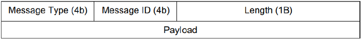

# Chat Client

This is a simple chat client that uses the chat server to send and receive messages.

This chat client uses TCP connection to communicate with the server. TCP connection is alive until
the client disconnects from the server.

Packet format is as follows:

There are 3 commands provided by the client:
- `list`: List all the users in the chat room
- `send <username> <message>`: Send a message to a specific user
- `exit`: Disconnect from the server

After sending each command client will wait for the server to respond.

Client is capable of receiving messages from other users even when waiting for user input. This feature is implemented
using linux signal and interrupts. Client starts a timer for 3 seconds and if user not enter any input within 3 seconds
client check for any  incoming messages. If there is any message client will print it and start the timer again.

